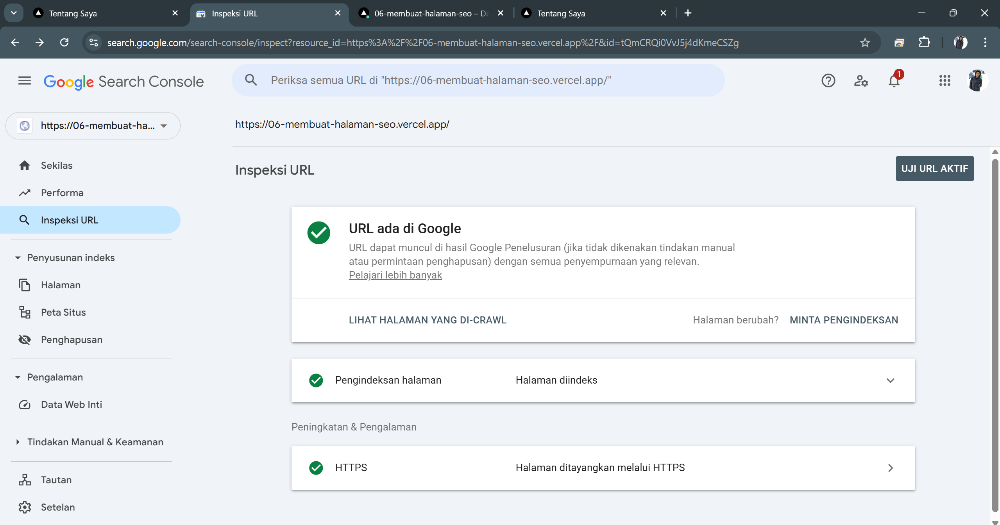

# Laporan Praktikum

|       | Pemrograman Berbasis Framework 2025 |
| ----- | ----------------------------------- |
| NIM   | 2241720225                          |
| Nama  | Bagus Arnovario Wibowo              |
| Kelas | TI - 3A                             |

## Langkah-langkah Praktikum

## Praktikum 1 : Memahami Pentingnya SEO

SEO (Search Engine Optimization) adalah praktik mengoptimalkan website agar mudah ditemukan oleh mesin pencari seperti Google. Dengan SEO yang baik, website Anda akan lebih mudah muncul di hasil pencarian, sehingga meningkatkan traffic pengunjung.

Beberapa elemen penting dalam SEO:

•	Title Tag: Judul halaman yang muncul di hasil pencarian.
•	Meta Description: Deskripsi singkat tentang halaman.
•	Heading Tags (H1, H2, dll.): Struktur konten yang membantu mesin pencari memahami isi halaman.
•	URL Structure: URL yang deskriptif dan mudah dibaca.
•	Open Graph Tags: Metadata untuk media sosial seperti Facebook dan Twitter.
•	Favicon: Ikon kecil yang muncul di tab browser.

## Praktikum 2 : Menambahkan Favicon

Favicon adalah ikon kecil yang muncul di tab browser dan bookmark. Favicon membantu meningkatkan identitas brand website Anda.

Langkah-langkah:

1.	Siapkan file favicon (format .ico) dan letakkan di folder public/.
2.	Hapus faveicon.ico yang ada di folder src/app
.png)
3.	Update file src/components/layout.tsx untuk menambahkan favicon:
.png)
4.	Simpan dan jalankan proyek. Favicon akan muncul di tab browser.
.png)

## Praktikum 3 : Menambahkan Metadata untuk SEO

Metadata seperti title dan description sangat penting untuk SEO. Metadata ini akan muncul di hasil pencarian dan membantu mesin pencari memahami konten halaman.

Langkah-langkah:

1.	Buat file src/utils/metadata.ts untuk menyimpan metadata default:
.png)
2.	Update file src/components/layout.tsx untuk menggunakan metadata default jika tidak ada metadata yang di-pass:
.png)
3.	Update Setiap Halaman untuk dapat mem-pass definisi metadata
    Contoh Halaman “Tentang Saya”
.png)
4.	Lanjutkan untuk halaman Proyek dan Esai
.png)

## Praktikum 4 : Open Graph Tags untuk Media Sosial

Open Graph Tags digunakan untuk mengontrol bagaimana konten Anda ditampilkan saat dibagikan di media sosial seperti Facebook dan Twitter.
Langkah-langkah:
1.	Pastikan Anda telah menambahkan Open Graph Tags di layout.tsx seperti yang telah dijelaskan sebelumnya.
2.	Update metadata di setiap halaman untuk menyertakan Open Graph Tags.
.png)
.png)
.png)

## Praktikum 5 : Menguji SEO

Setelah menambahkan metadata, favicon, dan Open Graph Tags, Anda dapat menguji SEO dengan Membuka halaman di browser dan memeriksa elemen HTML menggunakan Developer Tools (Ctrl + Shift + I atau F12).

## Tugas 

Lakukan pengujian SEO dengan
1.	Gunakan tools seperti Google Search Console untuk memeriksa performa SEO dari suatu website.
